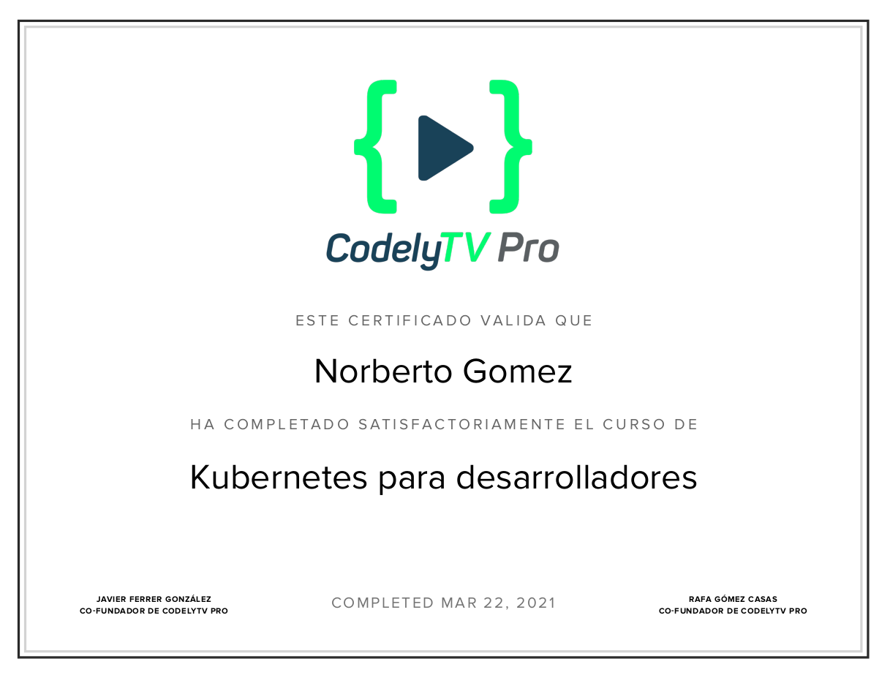
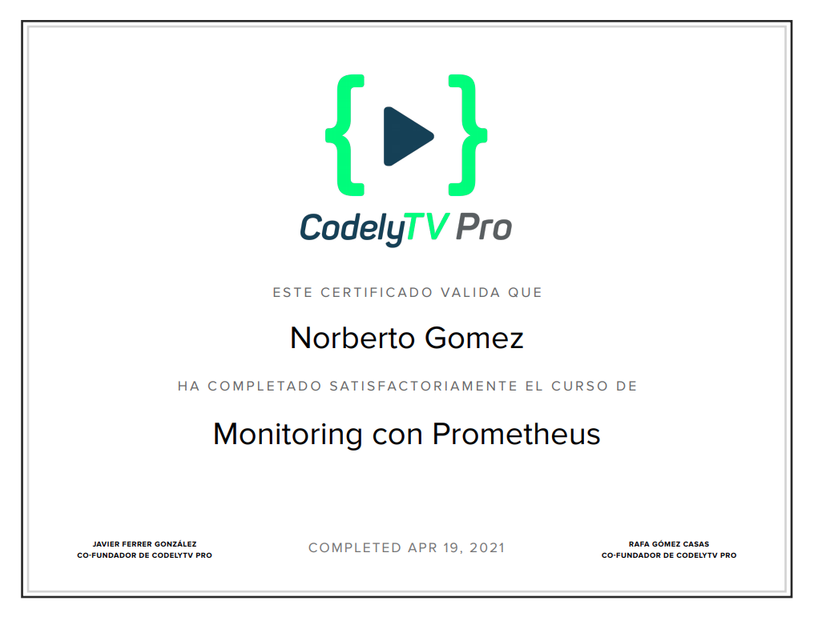

# The Mondays Project

This project is a sandbox to develop my skills and learn new things, here I will be trying out stuff in order to grow as a developer.

## Getting Started

These instructions will get you a copy of the project up and running on your local machine for development and testing purposes.

### Project Structure
```
the-mondays-project
├── course-certifications
│   └── kubernetes
├── devops
│   ├── docker
│   │   └── kafka
│   │       └── full-stack
│   └── kubernetes
│       ├── deploy
│       ├── ingress
│       └── pod
├── memories
└── monday
    └── GoApp
```

### Prerequisites

What things you need to install the software and how to install them

1. Install Docker version 19.03.8 minimum and docker-compose version 1.27.4.
2. Podman minimum version 3.0.0
3. Kubectl minimum version 1.20.5
4. minikube minimum version 1.18.1


### Installing

In order to set up this project a Makefile has been provided.

#### Docker/Podman version
To do a fresh install you need to run the following command at the root folder of the project.

```
Make start
```

#### Kubernetes version
Initialize minikube and all the requirements
```
Make start-kubernetes
```
Enable ingress
```
minikube addons enable ingress
```

Create the deploy object with exposing and ingress.
```
Make kubernetes-deploy-go-app
```

## Built With

* [Kafka](https://kafka.apache.org/)
* [Zookeeper](https://zookeeper.apache.org/)
* [Zoonavigator](https://zoonavigator.elkozmon.com/en/latest/)
* [KsqlDB](https://ksqldb.io/)
* [Kafka Connect](https://docs.confluent.io/home/connect/overview.html)
* [Podman](https://podman.io/)
* [Docker](https://www.docker.com/)
* [Kubernetes](https://kubernetes.io/)

## Certifications




## Authors

* **Norberto Gomez Bonnin** - [Github](https://github.com/norbertogomez)
